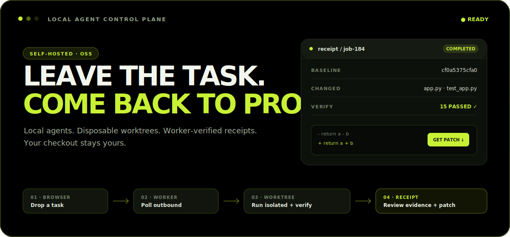
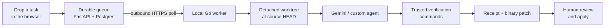

<p align="center">
  
</p>

<p align="center">
  <strong>A self-hosted inbox for local coding agents.</strong><br>
  Drop a task in the browser. Let an agent work in a disposable Git worktree.<br>
  Come back to worker-verified evidence and a patch you choose whether to apply.
</p>

<p align="center">
  <a href="https://github.com/haroon0x/DeadDrop/actions/workflows/ci.yaml"></a>
  <a href="https://github.com/haroon0x/DeadDrop/releases"></a>
  <a href="LICENSE"></a>
  <a href="https://github.com/haroon0x/DeadDrop/stargazers"></a>
  
  
</p>

<p align="center">
  <a href="#the-five-minute-proof">Quickstart</a>
  · <a href="#how-it-works">How it works</a>
  · <a href="#why-deaddrop">Why DeadDrop</a>
  · <a href="#security-model">Security</a>
  · <a href="docs/architecture.md">Architecture</a>
  · <a href="CONTRIBUTING.md">Contribute</a>
</p>

---

## The short version

Most coding-agent workflows make you choose between watching a terminal or giving an unattended process your working checkout.

DeadDrop gives you a third option:

```text
leave task  →  local worker claims it  →  agent edits a clean worktree
            →  worker runs your checks  →  you receive proof + a .patch
```

Your browser never opens a connection to your machine. The Go worker polls the server outbound, maps a safe alias to a local repository, and processes one job at a time. The agent never needs access to the server token, and the server never learns your absolute repository path.

> [!IMPORTANT]
> DeadDrop isolates **Git state**, not the operating system. The agent still has the filesystem, network, tools, and credentials available to the worker account. Use a dedicated non-root user and read the [security model](#security-model).

## See the loop



<table>
  <tr>
    <td width="50%">
      <strong>Your checkout</strong><br><br>
      Dirty edits stay dirty.<br>
      Untracked files stay private.<br>
      No automatic commit, push, or merge.
    </td>
    <td width="50%">
      <strong>The agent workspace</strong><br><br>
      Clean, detached, disposable.<br>
      Pinned to an exact baseline commit.<br>
      Removed after evidence is captured.
    </td>
  </tr>
</table>

## Proof, not agent prose

The agent writes the human summary. The worker establishes the facts.

```text
┌─ RECEIPT / JOB #184 ───────────────────────────────────────────┐
│ status       COMPLETED                                         │
│ baseline     9f2a7c1b6e04                                      │
│ changed      app.py                                            │
│ verify       python -m pytest                    PASSED · exit 0 │
│ patch        deaddrop-job-184.patch                      READY  │
└─────────────────────────────────────────────────────────────────┘

  def add(a, b):
-     return a - b
+     return a + b
```

DeadDrop replaces agent claims about status, changed files, and verification with evidence observed by the worker:

| Receipt field | Authority |
| --- | --- |
| Summary, notes, blockers | Agent-authored context |
| Status and exit code | Worker-observed process result |
| Changed files | Baseline-relative Git diff |
| Verification | Commands executed by the worker |
| Baseline | Exact source `HEAD` used for the worktree |
| Patch | Binary-capable Git diff captured from the worktree |

## Why DeadDrop?

### Your agent can leave. Your repository should not have to.

DeadDrop is designed around a small promise: asynchronous coding work should not make your current checkout disposable.

| | Direct agent in your checkout | DeadDrop |
| --- | --- | --- |
| Local dirty work | Shared with the agent | Excluded from the job |
| Execution baseline | Whatever is on disk | Exact committed `HEAD` |
| Network direction | Tool-dependent | Worker polls outbound only |
| Test claims | Often agent-reported | Worker executes configured checks |
| Worker crash | Manual recovery | Lease expires and job is requeued |
| Lost result response | Result may disappear | Terminal payload is spooled and replayed |
| Final handoff | Terminal transcript | Receipt, changed files, baseline, and `.patch` |
| Acceptance | Often implicit | Explicit human review and apply |

### Built for the boring failure modes

- **Disposable worktrees** protect the source checkout from agent edits.
- **Attempts and leases** recover jobs after a laptop sleeps, crashes, or disconnects.
- **Heartbeats** prove which worker still owns the right to write a result.
- **Stale-write rejection** prevents an old worker from overwriting a newer attempt.
- **Durable result replay** preserves completion when the network fails at the worst moment.
- **Running cancellation** interrupts the agent process tree and still captures partial evidence.
- **Authenticated patch handoff** keeps review and acceptance in human hands.

## The five-minute proof

The fastest first run uses the deterministic mock agent and bundled failing repository. It proves the whole server → worker → worktree → verification → patch loop without requiring an AI provider account.

### 1. Start the server

Requirements: Docker with Compose, Git, and Go 1.22+.

```bash
git clone https://github.com/haroon0x/DeadDrop.git
cd DeadDrop

export OWNER_TOKEN="$(openssl rand -hex 32)"
export WORKER_TOKEN="$(openssl rand -hex 32)"
export POSTGRES_PASSWORD="$(openssl rand -hex 32)"

docker compose up -d --build
```

Open [`http://localhost:8000/login`](http://localhost:8000/login) and enter `OWNER_TOKEN`.

### 2. Start the local worker

```bash
cd worker
go build -trimpath -o deaddrop-worker .

./deaddrop-worker run \
  --server http://localhost:8000 \
  --token "$WORKER_TOKEN" \
  --manifest deaddrop.manifest.example.json \
  --agent mock
```

### 3. Drop this task

```text
Title: Fix the demo addition bug
Task: Fix app.py so add returns a + b. Return a clear receipt.
```

Watch the job move from **queued** → **running** → **completed**. The receipt should report `app.py`, a passing `python -m pytest`, the exact baseline, and a downloadable patch. The original `examples/demo-repo/app.py` remains unchanged.

> [!NOTE]
> The bundled workspace lives inside this repository and is intended only for the deterministic mock demo. Configure real projects with `deaddrop-worker init` before using Gemini or another coding agent.

## Run it on a real project

### Create the local trust boundary

The manifest stays on the worker machine. Give DeadDrop only the repositories and verification commands it may use:

```bash
./deaddrop-worker init \
  --repo /absolute/path/to/your-project \
  --verify "go test ./..." \
  --verify "go vet ./..."
```

This creates:

```json
{
  "repos": [
    {
      "alias": "default",
      "name": "your-project",
      "path": "/absolute/path/to/your-project",
      "verify": ["go test ./...", "go vet ./..."]
    }
  ]
}
```

The path may be a Git root or a committed subdirectory. The server receives `default`, not the absolute path.

### Pick an agent

| Mode | Use it for | Command |
| --- | --- | --- |
| `gemini` | Gemini CLI with structured JSON output | `--agent gemini` |
| `custom` | Any local CLI that can accept a rendered prompt | `--agent custom --command-template 'your-agent "{{prompt}}"'` |
| `mock` | Deterministic demos and E2E verification | `--agent mock` |

Start a real worker:

```bash
./deaddrop-worker run \
  --server https://deaddrop.example.com \
  --token "$WORKER_TOKEN" \
  --manifest deaddrop.manifest.json \
  --agent gemini
```

The worker supports Linux, macOS, and Windows. Tagged releases publish `amd64` and `arm64` binaries plus `SHA256SUMS` on the [Releases page](https://github.com/haroon0x/DeadDrop/releases).

<details>
<summary><strong>Run one workspace without a manifest</strong></summary>

```bash
./deaddrop-worker run \
  --server http://localhost:8000 \
  --token "$WORKER_TOKEN" \
  --repo /absolute/path/to/project \
  --repo-alias default \
  --verify "python -m pytest" \
  --agent custom \
  --command-template 'your-agent "{{prompt}}"'
```

</details>

<details>
<summary><strong>Worker command reference</strong></summary>

```text
deaddrop-worker version
deaddrop-worker init --repo PATH [--name NAME] [--output FILE] [--verify COMMAND]
deaddrop-worker run --server URL --token TOKEN (--manifest FILE | --repo PATH) [flags]
```

| Flag | Meaning |
| --- | --- |
| `--worker` | Worker route; defaults to `local` |
| `--repo-alias` | Alias for single-repository mode; defaults to `default` |
| `--agent` | `gemini`, `custom`, or `mock` |
| `--command-template` | Custom mode template with `{{prompt}}`, `{{task}}`, and `{{repo}}` |
| `--verify` | Trusted verification command; repeatable |
| `--poll-interval` | Idle polling interval in seconds; defaults to `3` |
| `--agent-timeout` | Agent and verification timeout in seconds; defaults to `900` |
| `--run-once` | Claim at most one job and exit |
| `--dry-run` | Render agent behavior without executing it |

</details>

## Review and apply

DeadDrop never silently accepts its own result.

1. Open the completed job.
2. Read the agent summary and worker-observed verification.
3. Inspect the changed-file list and Git diff.
4. Select **Download .patch**.
5. Commit or stash unrelated work in the target repository.
6. Check and apply deliberately:

```bash
git apply --stat /path/to/deaddrop-job-42.patch
git apply --check /path/to/deaddrop-job-42.patch
git apply /path/to/deaddrop-job-42.patch
```

Run the project checks again, inspect `git diff`, and commit only when the result is acceptable. If your branch moved after the receipt baseline, review carefully and use `git apply --3way` only when you are prepared to resolve conflicts.

API clients can download the same artifact from `GET /api/jobs/{job_id}/patch` with the owner bearer token.

## How it works

DeadDrop separates coordination from execution:

```text
┌──────────────────── CONTROL PLANE ────────────────────┐
│                                                       │
│  Browser ── OWNER_TOKEN ──▶ FastAPI ──▶ PostgreSQL   │
│                              ▲         jobs           │
│                              │         attempts       │
│                              │         logs/patches   │
└──────────────────────────────┼────────────────────────┘
                               │ outbound HTTPS
┌──────────────────── EXECUTION PLANE ──────────────────┐
│                              │                        │
│  source repo ──▶ Go worker ──┘                        │
│       │              │                                │
│       │              ▼                                │
│       │      detached worktree ──▶ coding agent       │
│       │              │                                │
│       └── unchanged  └──▶ verification + Git patch   │
└───────────────────────────────────────────────────────┘
```

Every claim receives a unique attempt ID and a sixty-second lease. The worker renews that lease every five seconds. An expired attempt becomes `lost`, its job returns to the queue, and late writes from the stale attempt are rejected.

Terminal delivery is idempotent. If the server cannot receive a completion, failure, or cancellation result, the worker atomically spools it under the user configuration directory and replays it before claiming more work.

Read the full [architecture guide](docs/architecture.md) for lifecycle transitions, cancellation races, worktree creation, patch capture, transport retries, persistence, and trust boundaries.

## Security model

DeadDrop protects the control path and source Git state. It does **not** sandbox arbitrary code.

### Trust these

- The server operator and configured server URL
- The owner and worker tokens
- Local manifest paths and verification commands
- The operating-system account running the worker

### Treat these as untrusted

- Task prompts
- Agent output and receipt claims
- Files produced by the agent until reviewed

### Operate it safely

- Run the worker as a dedicated non-root user.
- Expose only repositories that account may access.
- Keep credentials out of the agent environment where possible.
- Use HTTPS and secure cookies outside local development.
- Use independent, high-entropy owner and worker tokens.
- Put PostgreSQL on persistent storage and back it up.
- Review every patch before applying it.

> [!WARNING]
> A task can cause the configured agent to execute commands with the worker account's permissions. A Git worktree protects repository state; it is not a container, VM, permission boundary, or network sandbox.

See [SECURITY.md](SECURITY.md) for vulnerability reporting and [deployment.md](docs/deployment.md) for the production checklist.

## What DeadDrop is—and is not

| DeadDrop is | DeadDrop is not |
| --- | --- |
| A self-hosted task inbox | A hosted multi-tenant SaaS |
| An outbound local-worker protocol | A browser-accessible remote shell |
| A disposable Git workspace runner | An operating-system sandbox |
| An evidence and patch handoff | An automatic merge bot |
| Built for individual developers and small trusted teams | An enterprise identity or billing platform |

The project deliberately avoids automatic commit, push, merge, and patch application. Human acceptance is part of the architecture, not a missing button.

## Project status

DeadDrop is **pre-1.0** and ready for local evaluation and open-source contribution. The core workflow is implemented and covered end-to-end:

- Durable FastAPI/PostgreSQL control plane with Alembic migrations
- Cross-platform Go worker with release binaries
- Disposable worktrees and binary-capable patch capture
- Leases, heartbeats, cancellation, stale recovery, and result replay
- Worker-authoritative receipts and verification
- Authenticated patch downloads and baseline evidence
- Server, worker, migration, and full E2E coverage in CI

Before using it for sensitive or production-critical repositories, review the security model, pin a release, test your provider and verification commands, and keep an independent repository backup.

Follow [todo.md](todo.md) for the next release work and [updates](server/app/templates/updates.html) for the project narrative.

## Documentation

| Guide | What it answers |
| --- | --- |
| [Architecture](docs/architecture.md) | How jobs, attempts, worktrees, receipts, and recovery fit together |
| [Deployment](docs/deployment.md) | How to run Compose, managed PostgreSQL, secrets, backups, and upgrades |
| [Worker service](docs/worker-service.md) | How to keep the worker alive across reboots |
| [Release process](docs/releases.md) | How binaries, checksums, tags, and compatibility are shipped |
| [Demo script](docs/demo-script.md) | How to show the complete deterministic workflow |
| [Security policy](SECURITY.md) | How to report vulnerabilities and operate within the trust model |
| [Support](SUPPORT.md) | Where to ask usage questions and what information to include |

The repository also includes technical essays on [disposable worktrees](server/app/templates/blog_disposable_worktrees.html), [evidence-based receipts](server/app/templates/blog_evidence_receipts.html), and [leases for local agents](server/app/templates/blog_leases.html).

## Develop

Server:

```bash
cd server
uv sync --frozen
export OWNER_TOKEN=owner-dev
export WORKER_TOKEN=worker-dev
export DATABASE_URL=sqlite:///./deaddrop.db
export SECURE_COOKIES=false
uv run uvicorn app.main:app --reload
```

Verification:

```bash
cd server && uv run pytest -q && uv run alembic check
cd ../worker && go test ./... && go vet ./...
cd .. && server/.venv/bin/python -m pytest -q e2e
```

Read [CONTRIBUTING.md](CONTRIBUTING.md) before opening a pull request. Focused bug reports should include the server version, worker version, operating system, agent mode, relevant redacted logs, and reproduction steps.

## Frequently asked questions

<details>
<summary><strong>Does DeadDrop modify my current checkout?</strong></summary>

No. It resolves the source repository's committed `HEAD`, creates a detached temporary worktree, runs the job there, captures the result, and removes the worktree. Dirty tracked files and untracked files from the source checkout are not copied into the job.

</details>

<details>
<summary><strong>Can I use an agent other than Gemini?</strong></summary>

Yes. Custom mode renders a command template for any local CLI. The command must ultimately return the structured receipt expected by the worker. Mock mode provides a deterministic demonstration and E2E path.

</details>

<details>
<summary><strong>Why does the worker poll instead of accepting incoming connections?</strong></summary>

The developer machine does not need an open port, tunnel, or inbound firewall rule. The worker initiates every server connection and owns the alias-to-local-path mapping.

</details>

<details>
<summary><strong>Why not apply or merge successful patches automatically?</strong></summary>

Passing configured checks is evidence, not authorization. DeadDrop gives the human a baseline, receipt, changed-file list, and patch so acceptance remains an explicit decision.

</details>

<details>
<summary><strong>Is the worker a secure sandbox?</strong></summary>

No. It isolates Git state only. Use a dedicated operating-system account, restrict that account's repositories and credentials, and add a stronger sandbox outside DeadDrop when your threat model requires one.

</details>

## Contributing

Issues, focused pull requests, deployment reports, and real-agent compatibility findings are welcome. Start with [CONTRIBUTING.md](CONTRIBUTING.md), check the [roadmap](todo.md), and use [SUPPORT.md](SUPPORT.md) for usage questions.

<p align="center">
  <strong>Leave the task. Come back to proof.</strong><br><br>
  <a href="https://github.com/haroon0x/DeadDrop/stargazers">Star DeadDrop</a>
  · <a href="https://github.com/haroon0x/DeadDrop/issues">Report an issue</a>
  · <a href="https://github.com/haroon0x/DeadDrop/releases">Download a worker</a>
</p>

<p align="center">
  GPL-3.0 · Built for human-reviewed local agents
</p>
